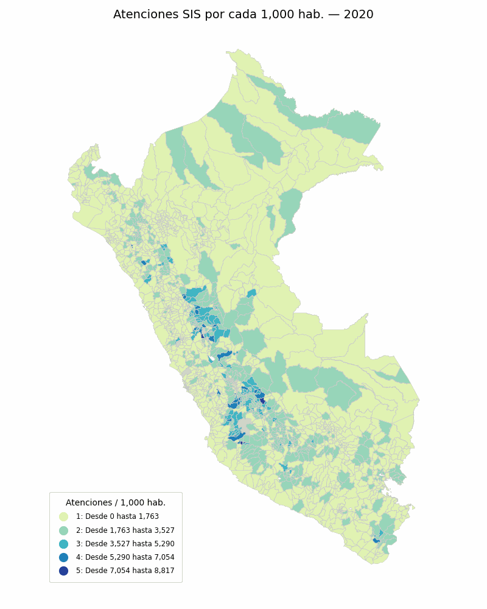
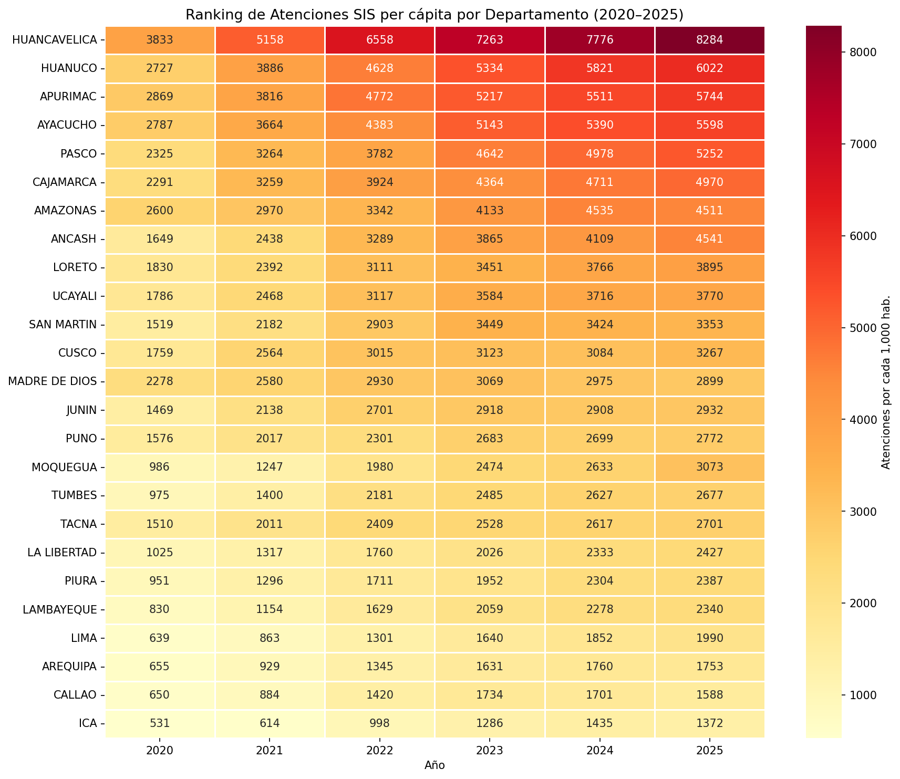
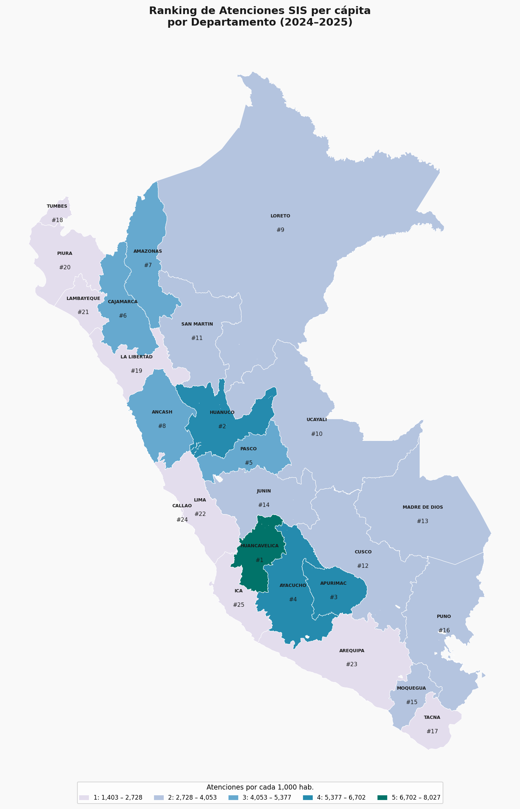

# Análisis Geoespacial de Atenciones SIS — Perú (2017–2025)

Análisis de las atenciones realizadas a asegurados del Seguro Integral de Salud (SIS) a nivel distrital en Perú, usando GeoPandas para visualización geoespacial.

## Datos

Los archivos CSV **no están incluidos** en el repositorio por su tamaño (~14 GB en total).

Descárgalos desde la fuente oficial del Ministerio de Salud:

**[Datos Abiertos del Gobierno del Perú — Atenciones SIS](https://www.datosabiertos.gob.pe/dataset/datos-de-atenciones-realizadas-los-asegurados-sis)**

Una vez descargados, colócalos en la carpeta `Data/` con sus nombres originales.

## Estructura del proyecto

```
├── analisis_Geopandas.ipynb   # Notebook principal
├── requirements.txt           # Dependencias Python
├── Data/
│   ├── shapefile/             # Shapefile de distritos del Perú (INEI)
│   └── OPENDATA_DS_01_<AÑO>_ATENCIONES.csv   # Descargar aparte
```

## Instalación

```bash
python3 -m venv .venv
source .venv/bin/activate
pip install -r requirements.txt
jupyter notebook
```

Selecciona el kernel **"Python (geopandas)"** al abrir el notebook.

## Visualizaciones






